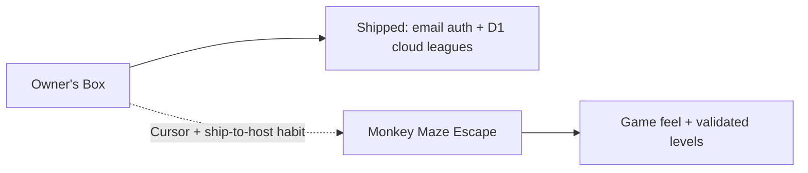

# Side Projects — Personal Portfolio

**Independent builds · outside Dallas ISD CTE**

> Apps and experiments I design and ship on my own time — product work, game craft, and cloud deployment — using Cursor AI as a development partner. Separate from my [Dallas ISD CTE tools portfolio](https://github.com/KxngAshby/Dallas-ISD-CTE-Portfolio).

---

## About This Portfolio

At work I ship internal CTE tools on Google Workspace. On the side I build products that need a different stack: public hosting, real-time sports data, game loops, and shared multiplayer state.

These are **my personal projects**. They are not Dallas ISD systems. The case studies below use the same honesty bar as my work portfolio: what each thing does, what was hard, what worked, what did not, and what I am still learning.

**This is a living portfolio.** Projects may be added, updated, or removed as I keep building. What you see here reflects where I am right now.

---

## How the Projects Connect

| Project | Audience | Core problem / itch |
|---|---|---|
| [Owner's Box](#1-owners-box) | Friends running a salary-cap fantasy league | Snake-draft apps ignore payroll; we want contracts, cap, and real NFL weeks |
| [Monkey Maze Escape](#2-monkey-maze-escape) | Anyone who wants a quick browser maze run | Small craft piece: collect gems, open the gate, outrun a pathfinding guardian |

---

## 1. Owner's Box

**What it does**

Invite-only salary-cap franchise fantasy with **shared cloud leagues**. Owners sign in with email, create or join a league from a multi-league hub, and manage a **$1000** payroll through public contract offers, ESPN-style lineups, injuries, and commissioner-approved trades. Scoring is ESPN Half-PPR against the **real** NFL slate — no simulated weeks. The league creator runs the commissioner desk. Shareable brief: `/pitch` and `owners-box/ONEPAGER.md`.

**Live**

https://app.franchisefantasy.workers.dev/login

**Technology**

Next.js · React · TypeScript · Tailwind CSS · ESPN public NFL APIs · Cloudflare Workers (OpenNext) · Cloudflare D1 (auth, memberships, versioned league snapshots) · server-side `applyLeagueAction` reducer

**Portfolio folder**

- `owners-box/` — product docs (`PRODUCT.md`, one-pager HTML/MD). Full source: [KxngAshby/franchise-football](https://github.com/KxngAshby/franchise-football)

**Challenges**

- **Product clarity under a working-title repo.** The folder was `franchise-football`; the brand that had to win the first viewport was **Owner's Box**. Naming and UI had to agree.
- **"Live" host ≠ shared league (solved).** The first Workers deploy still kept leagues in `localStorage`. Friends were not in one room until D1 + email auth shipped.
- **Auth that fits a friends league.** Replaced PIN / team-code login with email codes + invite-only join, while keeping the invite mental model.
- **Server-authoritative mutations.** Cap, bids, lineups, and trades now go through a shared action reducer so every phone sees the same room.
- **Private codes leaking into public UI.** Founding a franchise once wrote secrets into the shared activity feed; scrubbing had to cover ticker, League feed, and hydrated history.

**What worked**

- **Cap and contracts as the game surface** — OVR-tied contract lengths, public bidding, D/ST as one unit, commissioner trade gate
- **Email identity + invite rooms** — seats follow the account; one invite opens one live league
- **Multi-league hub** — create, join, and switch leagues without juggling browser storage
- **Smart auto-sync** — poll harder when games are live; ease off when idle; pause when the tab is hidden
- **Cloudflare Workers + D1 deploy path** — `npm run deploy` via OpenNext; stable workers.dev URL

**What did not work**

- **Putting secrets in the activity string** — convenient for the founding owner, catastrophic for a shared feed
- **Calling the first Workers URL "live multiplayer"** — hosting and shared state are different problems
- **Browser-local leagues as the product** — fine for demos, useless for a real friends season

**Still learning**

- **Production email delivery** — Resend (or verified domain) so login codes hit inboxes instead of a temporary on-screen code
- **Realtime push** — polling works; Durable Objects / WebSockets would tighten auction races
- **Hardening** — rate limits, stronger conflict retries, custom domain

**Key takeaway**

Shipping the UI to Cloudflare was step one. Shipping **shared cloud leagues** turned Owner's Box from a demo into a product friends can actually play together.

---

## 2. Monkey Maze Escape

**What it does**

A single-screen 8-bit browser maze: collect every gem to open a sealed gate, then reach the exit while a guardian monkey pathfinds toward you and speeds up as you loot. HUD shows gem pips and a threat meter; controls include WASD, sprint, and a start/restart flow with Web Audio SFX and light screen juice.

**Technology**

Vanilla HTML · CSS · Canvas 2D · Web Audio API · Google Fonts (`Press Start 2P`) · no build step

**Portfolio folder**

- `monkey-maze-escape/` — open `index.html` in a browser

**Challenges**

- **Softlock-proof levels.** An ASCII map is easy to draw wrong. The game **flood-fill validates** topology so every gem is reachable before the gate opens and the exit only becomes reachable after.
- **Guardian that feels unfair vs boring.** Pure chase is dull; random wandering is cheeseable. The monkey uses **BFS pathfinding** with a cached path and rage that scales with gems collected / gate state.
- **Tight maze movement.** Corner clipping feels bad in grid games — axis-slide assist keeps motion readable without removing skill.

**What worked**

- **Validate the map before play** — catch broken layouts at startup instead of discovering softlocks mid-run
- **Cached BFS** — repath on a short cadence so the chase stays sharp without burning CPU every frame
- **Zero-build craft** — one HTML/CSS/JS surface; easy to share as a file or host on static pages later
- **Readable HUD + ticker** — objective text and threat meter make the rules obvious without a tutorial wall

**What did not work / limits**

- **No public host yet** — still a local demo until it sits on GitHub Pages (or similar)
- **Single level by design** — great for a craft study; not yet a content pipeline
- **No persistence or leaderboard** — session-only; fine for scope, thin as a "product"

**Still learning**

- **Shipping small games the same way I ship apps** — automatic deploy, shareable URL, versioned repo as the default, not an afterthought
- **Level authoring without breaking validation** — more maps without hand-fighting flood-fill constraints
- **Juice budget** — how much shake/particles/SFX helps before it distracts

**Key takeaway**

Small games are where I practice feel and algorithms without a product roadmap. The transferable habit: **validate the world before the player pays the cost of a bad map**.

---

## What I Learned From My Mistakes

### 1. Hosting is not multiplayer

A public URL means people can open the app. It does not mean they share one database. Owner's Box taught me to separate "deployed" from "shared league" in every pitch and README.

### 2. Never put private codes in public strings

Activity feeds, tickers, and logs are broadcast surfaces. Secrets belong in private owner UI (CapBar / post-claim save prompt), not in `newActivity(...)` text.

### 3. Fix the source of truth, then the displays

Scrubbing one component while another still renders the raw message (and while production lags local) looks like "the bug is still there." Write clean data, scrub on load, scrub every public surface, then redeploy.

### 4. Brand has to win the first viewport

If the hero still reads like a generic fantasy tool after you remove the nav, the branding failed. Owner's Box had to overpower the old `franchise-football` working title.

### 5. Demo honesty builds trust

`PRODUCT.md` principle: browser-local is fine; do not claim shared multiplayer until it ships. Same standard I want for this portfolio.

### 6. Validate before players suffer

Monkey Maze's flood-fill check is the game equivalent of schema migrations at work: catch structural mistakes before they hit a human.

---

## What I Am Still Learning

| Area | Why it matters | Where it shows up |
|---|---|---|
| **Realtime sync beyond polling** | Faster auctions / less conflict noise | Owner's Box next polish |
| **Transactional email in production** | Friends need codes in their inbox | Owner's Box |
| **Productizing small games** | Craft pieces deserve a URL and a repo, not only a local folder | Monkey Maze Escape |
| **Scope discipline on side projects** | Easy to chase features before the core loop is loved | Both |
| **Writing case studies as I go** | Work portfolio proved reflection compounds; side work needs the same paper trail | This repo |

---

## How My Workflow Evolved (side projects)

| Practice | Owner's Box | Monkey Maze Escape |
|---|---|---|
| **Architecture** | Next.js + cloud action API + Workers host | Single-page Canvas game |
| **Data / state** | D1 league snapshots + memberships; client hydrate/poll | In-memory session only |
| **Deployment** | OpenNext → Cloudflare Workers + D1 | Local `index.html` (host pending) |
| **AI partnership** | Cursor for product, cloud migrate, docs, deploy | Cursor-friendly small surface |
| **Honesty check** | Demo until shared sync shipped; then update the pitch | Explicit "craft / single level" |
| **Forward lesson** | Hosting ≠ multiplayer; ship the room | Ship URL + validation as defaults |

---

## Repository Links

| Project | Portfolio folder | GitHub / live |
|---|---|---|
| Owner's Box | `owners-box/` | [KxngAshby/franchise-football](https://github.com/KxngAshby/franchise-football) · [Live](https://app.franchisefantasy.workers.dev) |
| Monkey Maze Escape | `monkey-maze-escape/` | _this portfolio repo_ (play via `monkey-maze-escape/index.html`) |

**Related**

- Work / CTE tools portfolio: [KxngAshby/Dallas-ISD-CTE-Portfolio](https://github.com/KxngAshby/Dallas-ISD-CTE-Portfolio)

---

## Shared Technology Habits

| Habit | Side-project expression |
|---|---|
| Ship somewhere real | Cloudflare Workers for Owner's Box |
| Keep secrets out of shared UI | Activity privacy scrub; invite codes only where intended |
| Prefer boring durable hosts when learning | Static HTML for the maze; Workers when the app needs APIs |
| Document product constraints | `PRODUCT.md` / one-pager before claiming features |
| Reflect in public | This README — worked / didn't / still learning |

---

## Built With

I design and build every project in this portfolio on my own time. Cursor AI is a collaborative development partner — architecture, implementation, debugging, docs, and iteration.

---

*Personal side-projects portfolio · Last updated August 2026 · Subject to change as I keep shipping*
